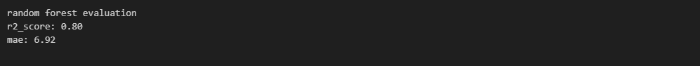
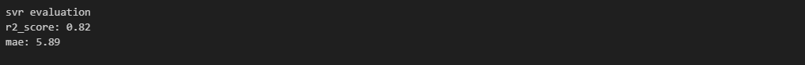

# Brief-2_Pr-diction-du-Temps-de-Livraison
## Contexte du projet
Prédire le temps total de livraison d’une commande pour améliorer le service client et optimiser les tournées.

## Fonctionnalités
- Notebook Jupyter : exploration et visualisations
- pipeline.py : fonctions de préparation et modélisation
- test_pipeline.py : scripts de tests unitaires
- ci avec github actions

## Installation
```bash
git clone <repo-url>
cd projet
pip install -r requirement.txt
```  
## Execution
```bash
python pipeline.py
```
## test unit
```bash
pytest
```
# résumé

> J’ai expérimenté deux modèles de Machine Learning (RandomForestRegressor et SVR) afin d’évaluer leurs performances sur un jeu de données équiibré.
Après comparaison à l’aide de plusieurs métriques (R² score et Mean Absolute Error (MAE)), j’ai retenu le modèle SVR, qui a obtenu le meilleur R² score et la plus faible erreur moyenne absolue, indiquant une meilleure capacité de prédiction sur ce jeu de données.

### modèles - RandomForestRegressor

### modèles - SVR


## Contributeur
- Yassine Gharabi — Développeur